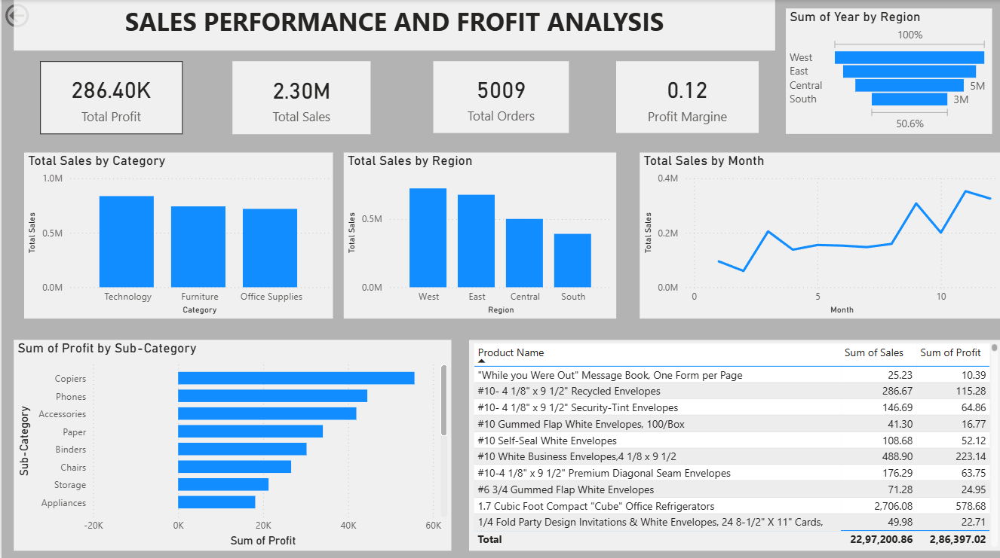

# Sales Performance & Profit Analysis Dashboard

## Project Overview
This project analyzes sales performance and profitability using the Superstore Sales Dataset.
The objective is to identify key revenue drivers, loss-making products, and regional performance
to support business decision-making.

Python is used for data cleaning and exploratory data analysis (EDA),
and Power BI is used to build an interactive dashboard.

---

## Dataset
Source: Superstore Sales Dataset (Kaggle / Tableau Public)

Columns used:
- Order Date, Ship Date
- Sales, Profit, Quantity
- Category, Sub-Category
- Region, State, City
- Customer Segment

---

## Tools & Technologies
- Python (Pandas, Matplotlib, Seaborn)
- Power BI Desktop
- Git & GitHub

---

## Data Cleaning & Feature Engineering
- Converted date columns to datetime format
- Removed duplicate records
- Checked and handled missing values
- Created new columns:
  - Year
  - Month
  - Profit Margin

---

## Exploratory Data Analysis (Python)
The following analysis was performed:
- Total Sales and Total Profit
- Sales by Category
- Profit by Sub-Category
- Monthly Sales Trend
- Region-wise Sales
- Top 10 Profitable Products
- Identification of loss-making sub-categories

---

## Power BI Dashboard Features

### KPI Cards
- Total Sales
- Total Profit
- Profit Margin
- Total Orders

### Visualizations
- Sales by Category
- Profit by Sub-Category
- Monthly Sales Trend
- Sales by Region
- Top 10 Profitable Products

### Filters (Slicers)
- Year
- Region
- Category

---

## Key Business Insights
- Technology category generates the highest sales, while Office Supplies have a higher profit margin.
- Tables and Bookcases consistently generate losses.
- The West region performs best in terms of sales and profit.
- Sales peak during Q4 (November–December), indicating seasonal demand.

---

## Dashboard Preview
Example:

---

## How to Use
1. Open the Power BI file located in the powerbi folder.
2. Use slicers to filter data by Year, Region, or Category.
3. Explore interactive visuals to gain insights.
4. Run the Python notebook in the notebooks folder to view EDA.

---

## Author
Dev  
Aspiring Data Analyst

